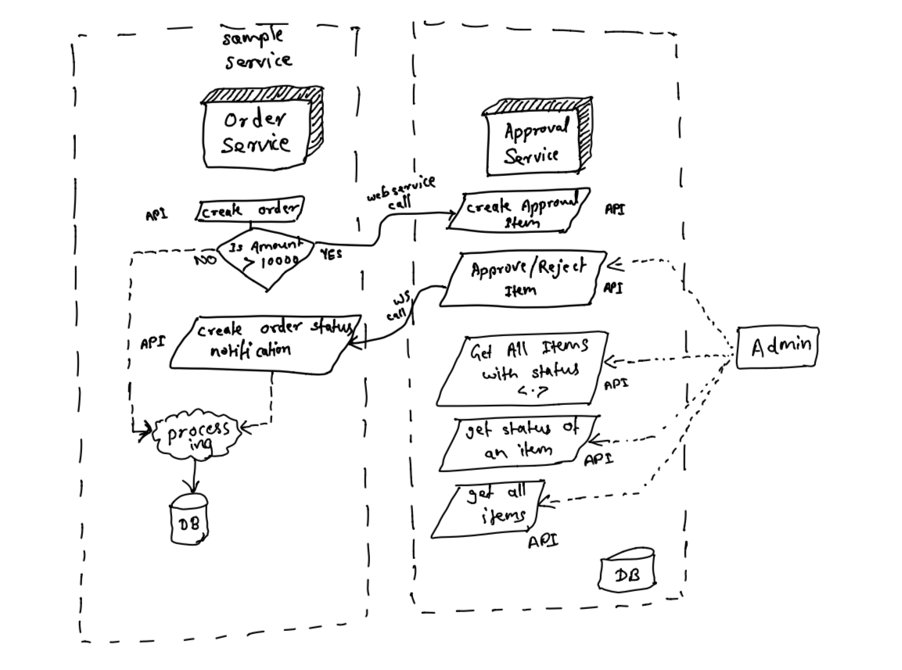

## Approval System
Approval Service allows other services e.g. OrderService to add items for approval. The backend uses`akka-http` for HTTP based services, postgres as DB, Slick for database queries. 


### System Flow



### Quick Start

#### Prerequisites
- Docker
- Postman(or any HTTP Request Client) 

#### Running services
Execute `docker-compose up` command on the root of the project as follows:
    
    `~/myWorkspace/approval-admin-system 👉 $docker-compose up`
    
   Docker is a pre-requisite to run the system locally. 

*Executing above command will build images for order and approval services, execute them on ports **8080** and **8081** respectively and fetch postgres image from registry and start it on port 5432. Ensure these ports are free before running the command. The required tables will be created by services on startup automatically*

**Note**:
After experimenting/testing with the services, run `docker-compose down` to remove containers and images. 


#### Creating a sample order

Create a sample order with content-type *application/json*
```
POST   http://localhost:8080/api/v1/order/

{
	"customerName": "John",
	"amount": 12000
}
```
Above call should respond with Sample Order with status as **Pending for Approval** as **Amount > 10000**.

#### Check if the item is submitted for approval

Send an HTTP GET Request to approval service(Running on port 8081) with order ID generated from above call.
```
GET   http://localhost:8081/api/v1/item/<put-order-id-here>
```

#### Approval/Reject item

Send an HTTP POST Request to approval service(Running on port 8081) with content-type *application/json* with order ID.
``` 
POST   http://localhost:8081/api/v1/item/<put-order-id-here>/status

{
    "status": "Approved"
}
```

#### Check if the order status has changed

Send an HTTP GET Request to order service(Running on port 8080) with order ID.
```
GET http://localhost:8080/api/v1/order/<put-order-id-here>
```
Response to above call should display updated status.


### APIs

#### Approval Service 
```
1. POST    /api/v1/item                 Create an approval item
2. POST    /api/v1/item/:id/status      Approve/Reject an approval item
3. GET     /api/v1/item/:id             See details of an approval item by id
4. GET     /api/v1/item/:id             See details of all approval items
5. GET     /api/v1/item/:id/status      See status of an approval item
6. GET     /api/v1/item?status=         See details of all approval items with given status
           <Pending|Approved|Rejected>
```

### Order Service
```
1.  POST    /api/v1/order                   Create a new Order
2.  GET     /api/v1/order/:id               See details of an order by id
3.  GET     /api/v1/order                   See details of all orders
4.  POST    /api/v1/order/:id/notifications Create status notification for an order with id
```


### Local Development

#### Environment Setup

Ensure to update the host in environment to *localhost* in resources (Currently it is set to host-names mentioned for docker apps).

For this, update following in approval-service's resource [file](approval-service/src/main/resources/application.conf) 

set `pgconf.properties.url` as `"jdbc:postgresql://localhost:5432/postgres"` 

Similarly make following updates in order-service's resource [file](order-service/src/main/resources/application.conf) 

set `pgconf.properties.url` as `"jdbc:postgresql://localhost:5432/postgres"` 

set `approval.service-url` as `"http://localhost:8081/api/v1/item"`

set `approval.notify-url` as `"http://localhost:8080/api/v1/order/"`

#### Execute
- On the root of the project, run `sbt compile` to compile the services.

    `~/myWorkspace/approval-admin-system 👉 $sbt compile`

- On successful compilation, start services on separate terminals as follows:  

    `~/myWorkspace/approval-admin-system 👉 $sbt "approvalService/run"`
    
    `~/myWorkspace/approval-admin-system 👉 $sbt "orderService/run"`
    
    *This will start order-service on port 8080 and approval-service on port 8081*

#### Test
- To run unit tests for approval-service, run `sbt approvalService/test`

    `~/myWorkspace/approval-admin-system 👉 $sbt "approvalService/test"`